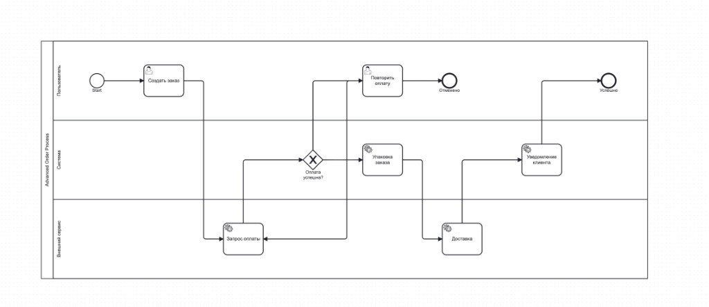

# json-to-bpmn-xml

[](https://www.npmjs.com/package/json-to-bpmn-xml)


Convert JSON workflow definitions into **valid, formatted BPMN 2.0 XML** with diagram layout (BPMNDI).

The output opens cleanly in tools like [bpmn.io](https://demo.bpmn.io) / Camunda Modeler: process semantics, swimlanes, and orthogonal sequence flows.



## Features

- **JSON → BPMN 2.0 XML** via [`bpmn-moddle`](https://github.com/bpmn-io/bpmn-moddle)
- **Pretty-printed XML** with declaration, namespaces, and `xsi:schemaLocation`
- **Node types**: start/end events, user/service tasks, exclusive & parallel gateways
- **Swimlanes (lanes)**: `laneSet`, `flowNodeRef`, collaboration + participant, DI shapes
- **Auto layout**:
  - X positions from [ELK](https://github.com/kieler/elkjs) (layered, left → right)
  - With lanes: nodes centered in lane bands; pool/lane headers do not overlap
  - Orthogonal (Manhattan) edges with side docks, loops, and obstacle-aware routing
- **Validation** of the input model (ids, edge ends, `laneId` references)
- **TypeScript** types exported from the package
- **ESM** module

## Supported Node Types

| JSON `type`         | BPMN element              |
| ------------------- | ------------------------- |
| `start`             | `bpmn:StartEvent`         |
| `end`               | `bpmn:EndEvent`           |
| `userTask`          | `bpmn:UserTask`           |
| `serviceTask`       | `bpmn:ServiceTask`        |
| `exclusiveGateway`  | `bpmn:ExclusiveGateway`   |
| `parallelGateway`   | `bpmn:ParallelGateway`    |

> More BPMN element types may be added in future releases.

## Installation

```bash
npm install json-to-bpmn-xml
```

## Quick start

```typescript
import { convert, type ProcessModel } from "json-to-bpmn-xml";

const model: ProcessModel = {
  id: "process_1",
  name: "Simple Process",
  nodes: [
    { id: "start", type: "start" },
    { id: "task1", type: "userTask", name: "Do something" },
    { id: "end", type: "end" },
  ],
  edges: [
    { id: "e1", source: "start", target: "task1" },
    { id: "e2", source: "task1", target: "end" },
  ],
};

const xml = await convert(model);
// → formatted BPMN 2.0 XML string
```

Without lanes, the diagram plane is bound to the **process** (no collaboration).

## Swimlanes (lanes)

Assign each node to a lane with `laneId`. The converter will generate:

- `bpmn:laneSet` / `bpmn:lane` with `flowNodeRef`
- `bpmn:collaboration` + `bpmn:participant` (pool)
- DI shapes for participant and lanes (lanes are inset so pool and lane titles do not overlap)
- Orthogonal cross-lane sequence flows

`laneId` is **input-only** — it is never written as an attribute on flow nodes in the XML.

```typescript
import { convert, type ProcessModel } from "json-to-bpmn-xml";

const model: ProcessModel = {
  id: "Process_Test_Lanes",
  name: "Lane Test Process",
  lanes: [
    { id: "Lane_1", name: "User" },
    { id: "Lane_2", name: "System" },
    { id: "Lane_3", name: "External Service" },
  ],
  nodes: [
    { id: "start", type: "start", name: "Start", laneId: "Lane_1" },
    { id: "task_user", type: "userTask", name: "Fill form", laneId: "Lane_1" },
    { id: "task_system", type: "serviceTask", name: "Validate data", laneId: "Lane_2" },
    { id: "task_ext", type: "serviceTask", name: "Call API", laneId: "Lane_3" },
    { id: "end", type: "end", name: "End", laneId: "Lane_1" },
  ],
  edges: [
    { id: "e1", source: "start", target: "task_user" },
    { id: "e2", source: "task_user", target: "task_system" },
    { id: "e3", source: "task_system", target: "task_ext" },
    { id: "e4", source: "task_ext", target: "end" },
  ],
};

const xml = await convert(model);
```

### Advanced example (gateway + loop + cross-lane)

Use the `advancedOrder` fixture:

```bash
npm run local
```

It lives in `fixtures/models/advanced-order.ts` and produces a multi-lane order process (User / System / External Service) with an exclusive gateway, retry loop, and two end events — the screenshot at the top of this README.

## API

### `convert(model): Promise<string>`

Main entry. Builds a BPMN model, computes layout, serializes and formats XML.

### `BpmnConverter`

Class API if you prefer an instance:

```typescript
import { BpmnConverter } from "json-to-bpmn-xml";

const converter = new BpmnConverter();
const xml = await converter.convert(model);
```

### Exported types

```typescript
import type {
  ProcessModel,
  INode,
  IEdge,
  ILane,
  NodeType,
} from "json-to-bpmn-xml";
```

## ProcessModel

```typescript
type NodeType =
  | "start"
  | "end"
  | "userTask"
  | "serviceTask"
  | "exclusiveGateway"
  | "parallelGateway";

type ProcessModel = {
  id: string;
  name?: string;
  /** Optional swimlanes. When set, collaboration + lane DI are generated. */
  lanes?: {
    id: string;
    name: string;
  }[];
  nodes: {
    id: string;
    type: NodeType;
    name?: string;
    /** References `lanes[].id`. Input-only (not emitted on the BPMN element). */
    laneId?: string;
  }[];
  edges: {
    id?: string;
    source: string;
    target: string;
    name?: string;
  }[];
};
```

### Validation rules

`convert` throws if:

- `id` is missing, or `nodes` is empty
- node / lane ids are duplicated
- an edge `source` / `target` does not match a node id
- a node `laneId` does not match any lane id

## Output

### Simple process (no lanes)

```xml
<?xml version="1.0" encoding="UTF-8"?>
<bpmn:definitions
  xmlns:bpmn="http://www.omg.org/spec/BPMN/20100524/MODEL"
  xmlns:bpmndi="http://www.omg.org/spec/BPMN/20100524/DI"
  xmlns:dc="http://www.omg.org/spec/DD/20100524/DC"
  xmlns:di="http://www.omg.org/spec/DD/20100524/DI"
  xmlns:xsi="http://www.w3.org/2001/XMLSchema-instance"
  id="process_1_definitions"
  targetNamespace="http://www.omg.org/spec/BPMN/20100524/MODEL"
  xsi:schemaLocation="http://www.omg.org/spec/BPMN/20100524/MODEL BPMN20.xsd">
  <bpmn:process id="process_1" name="Simple Process" isExecutable="false">
    <bpmn:startEvent id="start">
      <bpmn:outgoing>e1</bpmn:outgoing>
    </bpmn:startEvent>
    <bpmn:userTask id="task1" name="Do something">
      <bpmn:incoming>e1</bpmn:incoming>
      <bpmn:outgoing>e2</bpmn:outgoing>
    </bpmn:userTask>
    <bpmn:endEvent id="end">
      <bpmn:incoming>e2</bpmn:incoming>
    </bpmn:endEvent>
    <bpmn:sequenceFlow id="e1" sourceRef="start" targetRef="task1"/>
    <bpmn:sequenceFlow id="e2" sourceRef="task1" targetRef="end"/>
  </bpmn:process>
  <bpmndi:BPMNDiagram id="BPMNDiagram_1">
    <bpmndi:BPMNPlane id="BPMNPlane_1" bpmnElement="process_1">
      <!-- shapes + orthogonal edges -->
    </bpmndi:BPMNPlane>
  </bpmndi:BPMNDiagram>
</bpmn:definitions>
```

### With lanes

Root elements include **collaboration** (pool) and **process** with `laneSet`:

```xml
<bpmn:collaboration id="Collab_Process_Test_Lanes">
  <bpmn:participant
    id="Participant_Process_Test_Lanes"
    name="Lane Test Process"
    processRef="Process_Test_Lanes"/>
</bpmn:collaboration>

<bpmn:process id="Process_Test_Lanes" name="Lane Test Process" isExecutable="false">
  <bpmn:laneSet id="LaneSet_1">
    <bpmn:lane id="Lane_1" name="User">
      <bpmn:flowNodeRef>start</bpmn:flowNodeRef>
      <bpmn:flowNodeRef>task_user</bpmn:flowNodeRef>
      <bpmn:flowNodeRef>end</bpmn:flowNodeRef>
    </bpmn:lane>
    <!-- … -->
  </bpmn:laneSet>
  <!-- flow nodes + sequenceFlows -->
</bpmn:process>
```

Diagram plane is bound to the **collaboration**. Participant and lane shapes use `isHorizontal="true"`; lane bounds start after the pool header strip so titles do not collide.

## Layout notes

| Mode | Behavior |
| ---- | -------- |
| **No lanes** | ELK layered layout; plane → process |
| **With lanes** | ELK for horizontal order; nodes vertically centered in equal-height lanes; plane → collaboration |

**Edge routing** (especially with lanes):

- Orthogonal (90°) waypoints only
- Forward cross-lane links: side docks (`right` → `left`) with a vertical segment in the gap
- Upward branches (e.g. gateway → upper lane): exit from the **top**
- Backward loops: route around stacked nodes; approach the target dock **from outside** the shape (no arrows ending inside a task)
- Multiple flows on the same side of a node may share that side (valid BPMN)

Coordinates are deterministic for a given model (good for tests / snapshots). Exact numbers can change if layout constants or ELK options change.

## Examples in the repo

```bash
npm run example:simple    # process without lanes
npm run example:lanes     # three lanes
npm run example:gateway   # exclusive gateway
npm run example:service   # service task
npm run local             # advanced order fixture (edit scripts/local-run.ts to switch models)
npm test
npm run build
```

| Path | Description |
| ---- | ----------- |
| `examples/` | Runnable demo scripts |
| `fixtures/models/` | Reusable `ProcessModel` fixtures (English), for local-run and tests |
| `scripts/local-run.ts` | Dev runner — import any fixture and print XML |
| `tests/` | Vitest suite |
| `src/` | Library source (published via `dist/`) |

### Fixtures (`fixtures/models/`)

| Export | File | Purpose |
| ------ | ---- | ------- |
| `lanesSingleNode` | `lanes-single-node.ts` | Three lanes, one start event |
| `lanesSimpleFlow` | `lanes-simple-flow.ts` | Start → task → end in one lane |
| `orderCrossLane` | `order-cross-lane.ts` | Cross-lane flow with gateway |
| `advancedOrder` | `advanced-order.ts` | Full demo (retry loop, packing, delivery) |
| `processPayable` | `process-payable.ts` | Approximated pool from accounts-payable sample BPMN |
| `schedulePayments` | `schedule-payments.ts` | Approximated second pool from the same sample |

Switch the model in `scripts/local-run.ts`:

```typescript
import { convert } from "../src/index";
import { advancedOrder } from "../fixtures/models";
// import { lanesSimpleFlow } from "../fixtures/models";

const xml = await convert(advancedOrder);
console.log(xml);
```

## Built With

- [bpmn-moddle](https://github.com/bpmn-io/bpmn-moddle) — BPMN model + XML serialization
- [elkjs](https://github.com/kieler/elkjs) — graph layout (layered)
- [xml-formatter](https://github.com/chrisbottin/xml-formatter) — readable XML output

## License

Use under the terms of the [Apache-2.0](https://opensource.org/license/Apache-2.0).
